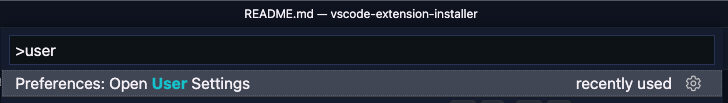
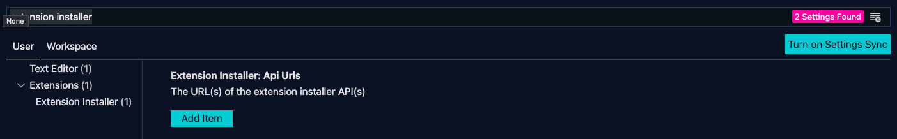
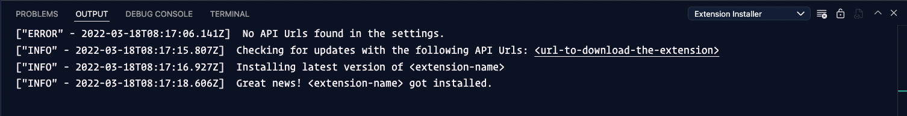

# The alternative extension installer

The extension came to life when I was looking for a way to install extensions that were not ready yet to be released to the marketplace. In order to release new updates quickly, without the need to give colleagues/testers/users a new `vsix` file each time, I decided to create a simple extension installer.

## Usage

Follow the next steps in order to use the extension:

- Install the extension in your VS Code editor
- Open the **Command Palette**
- Type: `User Settings` and select it



- Search for `Extension installer`



- Add a new item to the list (this will need to be provided by the extension author)
- Once you have added the URL(s), run the following command: `Extension Installer: Check for updates`

## The API

The API to retrieve the extension from is something you will need to implement yourself. This can be a simple JSON file, or a REST API. It will need to provide the extension with the following information:

```json
{
  "name": "<extension-name>",
  "download": "<url-to-download-the-extension>"
}
```

## Troubleshooting

In case there are issues with the extension, open the **Output** view, and check the `Extension Installer` output.

